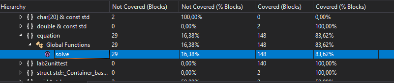
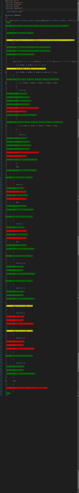

# ЛР работа №2

* lab_unittest.cpp - код тестов
* eauation.cpp - функция, которую необходимо протестировать. Изменен только ввод(6 аргументов) и вывод(tuple) 

## Процент покрытия функции solve:

## Покрытие ветвления:

*  Не покрыт
*  Частичное покрытие условия
*  Покрыт

## Выполнение тестов:

